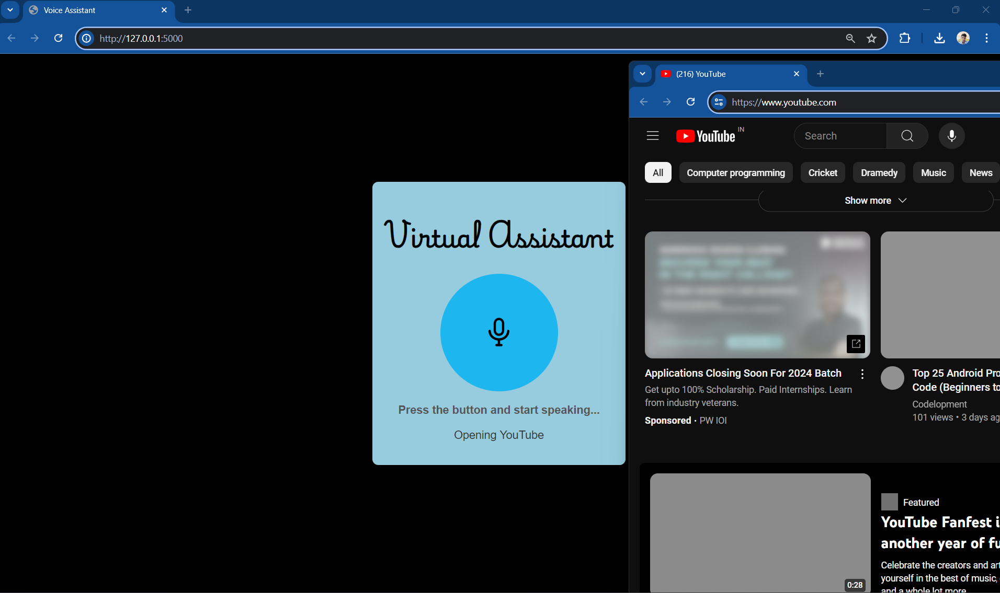

# Nova - Virtual Assistant

Nova is a virtual assistant powered by Flask, OpenAI, and various Python libraries. It can perform a range of tasks such as opening websites, searching on Google and YouTube, playing music, taking screenshots, providing the current time and date, reading news headlines, and more. Nova is designed to offer a user-friendly and interactive experience.

## Features

- **Voice Interaction**: Responds to user commands using speech recognition and text-to-speech functionalities.
- **Web Automation**: Opens websites and performs searches on Google and YouTube.
- **Music Playback**: Plays songs from a predefined music library.
- **System Control**: Takes screenshots and closes browser tabs.
- **News Updates**: Reads the latest news headlines using the News API.
- **Time and Date**: Provides the current time and date.
- **ChatGPT Integration**: Uses OpenAI's GPT-3.5-turbo for conversational responses.

## Requirements

- Python 3.6+
- Flask
- SpeechRecognition
- Pyttsx3
- Webbrowser
- Requests
- gTTS
- Pygame
- OpenAI
- PyAutoGUI
- Pillow

## Installation

1. **Clone the repository**:
    ```bash
    git clone https://github.com/yourusername/nova-virtual-assistant.git
    cd nova-virtual-assistant
    ```

2. **Install dependencies**:
    ```bash
    pip install -r requirements.txt
    ```

3. **Set up environment variables**:

   Create a `.env` file in the root directory and add your API keys:


Replace `your_news_api_key` and `your_openai_api_key` with your actual API keys.

## Usage

1. **Run the Flask application**:
 ```bash
 python app.py
 ```

2. **Access the web interface**:

Open your web browser and go to `http://127.0.0.1:5000/`.

3. **Interact with Nova**:

Use the text input or voice commands to interact with Nova. Examples of commands include:

- "Open Google"
- "Search Python tutorials"
- "Play Imagine by John Lennon"
- "What's the time?"
- "Show me the latest news"

## Configuration

- **Logging**: The application uses Python’s built-in logging module for error and debug logging. Adjust the logging level as needed.
- **API Keys**: Make sure to replace the placeholders with your actual API keys for OpenAI and NewsAPI.
- **Music Library**: Modify `musicLibrary.py` to add or update songs and their URLs.

## Notes

- Ensure you have a stable internet connection, as the application relies on several web-based services.
- Adjust your microphone and speaker settings to improve the accuracy of speech recognition and text-to-speech functionalities.
- This application requires access to your microphone and speakers for full functionality.

## Screenshots

Below are some screenshots of Nova in action:

### Demo of the Web Interface

.png)

### Command Execution Example



### Playing Music

.png)
## Contributing

We welcome contributions! Please fork the repository and submit a pull request for any enhancements or bug fixes.


## Acknowledgments

- OpenAI for the GPT-3.5-turbo model.
- NewsAPI for the latest news updates.
- Python community for the wonderful libraries that made this project possible.
